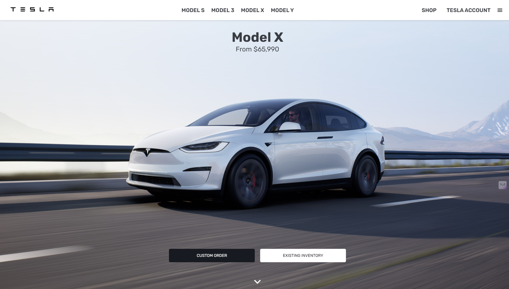
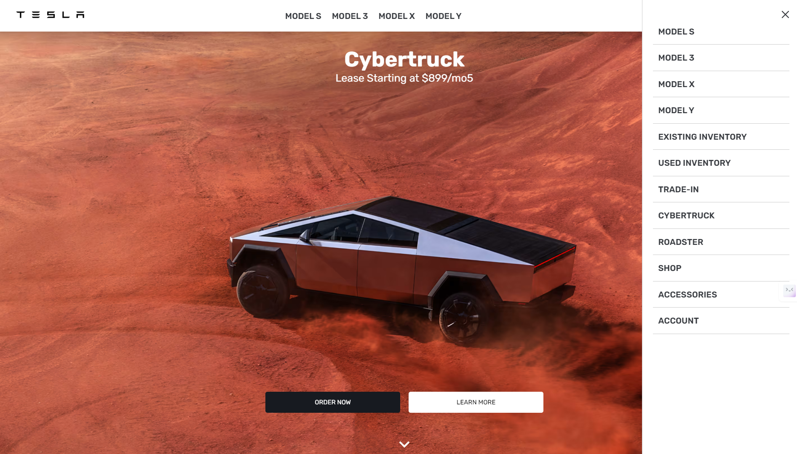

# 🖤 **Tesla India Landing Page Clone** ⚡  

> *A sleek, modern, and responsive landing page inspired by [tesla.com](https://www.tesla.com) built with cutting-edge frontend technologies.*  

---

## 🌟 **Introduction**  

Welcome to the **Tesla India Landing Page Clone**, a **pixel-perfect replica** of Tesla's minimalist, modern design.  
This project is a tribute to the stunning aesthetics of Tesla's official site, built using:  

- ⚛️ **React.js**  
- 🎨 **Styled-Components**  
- 🧩 **Material-UI**  
- 🔄 **Redux**  
- 💡 **HTML, CSS, JavaScript**  

Immerse yourself in a clean, fast, and responsive UI that mirrors Tesla's commitment to elegance and performance.  

---

## 🚀 **Live Demo**  

Experience the project live:  
**🔗 [teslaindia.vercel.app](https://teslaindia.vercel.app)**  

---

## 🖼 **Website Preview**  

### **Landing Page View**  
  

### **Navbar in Mid-Browsing**  
  

### **Hamburger Menu**  
 


*(Replace the above placeholders with actual screenshots for a professional touch.)*  

---

## 🛠 **Tech Stack**  

| **Technology**        | **Purpose**                          |
|------------------------|--------------------------------------|
| ⚛️ React.js           | Core frontend library                |
| 🎨 Styled-Components  | Component-level styling              |
| 🧩 Material-UI        | Prebuilt modern UI components        |
| 🔄 Redux              | State management                     |
| 🖥 HTML, CSS, JS      | Structure, styling, and interactivity|

---

## 📂 **Project Structure**  

```plaintext
tesla-india-clone/
├── public/                 
│   ├── images/                # Static images
│   ├── index.html             # Main HTML file
│   ├── manifest.json          # Web app manifest
│   └── robots.txt             # SEO-related file
├── src/                      
│   ├── app/                   
│   │   └── store.js           # Redux store setup
│   ├── components/            
│   │   ├── Footer.js          # Footer section
│   │   ├── Header.js          # Navigation bar
│   │   ├── Home.js            # Main landing page
│   │   └── HomeSection.js     # Reusable sections
│   ├── features/car/         
│   │   └── carSlice.js        # Car data state management
│   ├── helpers/               
│   │   └── Button.js          # Reusable button component
│   ├── App.js                 # Main React component
│   ├── App.css                # Global CSS
│   ├── index.js               # React DOM entry point
│   └── index.css              # Global styles
├── carInfo.json               # Static car data
├── .gitignore                 # Git ignore file
├── package.json               # Project dependencies
└── README.md                  # Project documentation
```

---

## 💻 **How to Run**  

Follow these steps to run the project locally:  

1. **Clone the repository**:  
   ```bash
   git clone https://github.com/Hailex798/Tesla_Clone-React.git
   cd tesla_clone-react
   ```

2. **Install dependencies**:  
   ```bash
   npm install
   ```

3. **Run the project**:  
   ```bash
   npm start
   ```

4. Open `http://localhost:3000` in your browser to view the app.  

---

## 🧩 **Features**  

- ✨ **Modern UI**: Inspired by Tesla's official design.  
- 🖥 **Fully Responsive**: Works seamlessly on all devices.  
- 🧩 **Reusable Components**: Modular components for scalability.  
- 🎨 **Styled with Styled-Components and Material-UI**.  
- 🔄 **State Management**: Integrated Redux for car data.  

---

## 🤝 **Contributing**  

Contributions are welcome! Here's how you can get involved:  

1. Fork the repository.  
2. Create a new branch: `git checkout -b feature/my-feature`.  
3. Make your changes and commit: `git commit -m "Add new feature"`.  
4. Push to the branch: `git push origin feature/my-feature`.  
5. Open a pull request.  

---

## 📝 **License**  

This project is licensed under the **MIT License**.  

---

## 📬 **Contact**  

If you have any questions or suggestions, feel free to reach out:  

- 📧 **Email**: kshitijsinghbisht777@email.com  
- 🔗 **Portfolio**: [Kshitij Singh Bisht](https://kshitijsinghbisht.netlify.app)  

---

> *"Simplicity is the ultimate sophistication."* - **Leonardo da Vinci**  

---

🖤 **Thank you for visiting!** 🚀  
